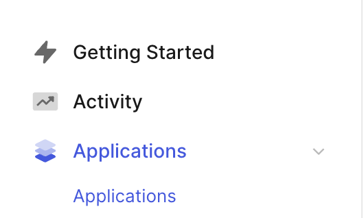
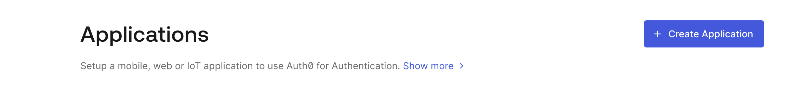
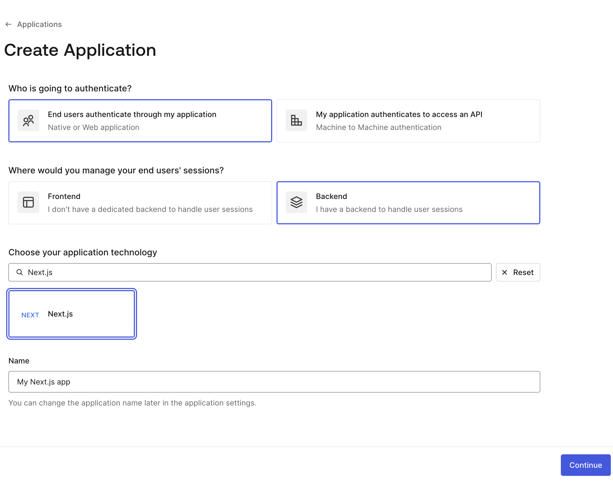

# Auth0 Setup

### Create an Auth0 Account:

1. Go to [Auth0](https://auth0.com) and create a new account or log in to your existing account.

### API Key Configuration:

To configure the API keys, follow these steps:

1. Open your terminal and generate a random secret key for `AUTH0_SECRET` using the command:
   ```bash
   openssl rand -hex 32

2. Copy the generated value and use it for the AUTH0_SECRET key.

3. Set the following values in your .env file:
    - **AUTH0_BASE_URL**: The base URL of your application.
    - **AUTH0_ISSUER_BASE_URL**: The URL of your Auth0 tenant domain. If you are using a Custom Domain with Auth0, set this to your Custom Domain value instead of the one shown in the "Settings" tab.
    - **AUTH0_CLIENT_ID**: Your Auth0 application's Client ID.
    - **AUTH0_CLIENT_SECRET**: Your Auth0 application's Client Secret.

### Configure Callback URLs:
1. Go to the Settings tab in your Auth0 dashboard.

2. Add your local and production URLs in the Allowed Callback URLs and Allowed Logout URLs fields:
   - Allowed Callback URL: http://localhost:3000/api/auth/callback
   - Allowed Logout URL: http://localhost:3000/


### How to create application in auth0 ?





