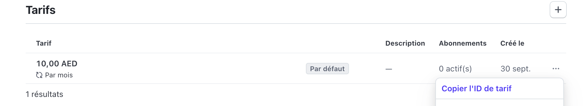

# Stripe Setup

### Create a Stripe Account:

1. Go to [Stripe](https://stripe.com) and create a new account or log in to your existing account.

2. Ensure that **Developer Mode** is activated to access the necessary keys and tools.

   

### Retrieve Your secret API Keys:

1. Navigate to the **Developers** section in your Stripe dashboard.
2. Copy your **Secret API Key** and update the `STRIPE_SECRET_KEY` in your `.env` file.

### Create a Product:

1. In your Stripe dashboard, create a new product with a pricing plan.
2. Copy the **Price ID** of the product.
   
3. Update your `.env` file with this ID by setting the `STRIPE_PRODUCT_ID`.

### Testing Payments:

To perform test payments, you can use the following test credit card details:

- **Card number**: `4242 4242 4242 4242`
- **Expiration date**: `01/26`
- **CVC**: `123`
